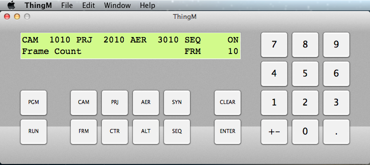

# ThingM-Remote
ThingM Remote Control

Remote Control App for ThingM-II and ThingM-OP optical printer controllers via serial port.
This Mac OS X app mimics the keypad layout and LCD character display of the ThingM-II controller,
though may also be used with the ThingM-OP controller without the extra function keys.

ThingM controllers with RS232 serial port enabled use a simple mapping of ASCII characters to controller keys.
Any serial terminal app could remotely type commands corresponding to ThingM keypad keys.
Number keys are mapped as "0" to "9", "-" for minus direction, and "." for decimal point.
Function keys are mapped as "P" for the Program key, and "R" for the Run key.
Data entry is completed by "Ctrl-M" Enter key, or escaped by backspace "Ctrl-H" Clear key.

Any USB Serial adapter could be used to interface to the ThingM RS232 serial port.
The ThingM controller back panel typically used AMP circular connectors, so the serial port would additionally be extended by a 9-pin D connector for attaching to the USB Serial adapter. USB Serial adapter models from Keyspan or Belkin work fine, as well as many generic models.

Based on Objective-C Calculator keypad example from Building Cocoa Applications.
Ported IOKit Serial port example from Apple Developer site.

Originally prototyped on PowerMac G4 OS X 10.3 Panther, then recompiled on Intel MacBook Pro OS X 10.5 Leopard.
Recently verified on 2012 MacBook Pro running OS X 10.13 High Sierra and 2017 MacBook Pro running OS X 10.14 Mojave.

Compiles for Mac OS X as an XCode project, either by IDE GUI or command line tools. 
To install XCode command line tools from a Terminal session, use `xcode-select --install`.

To compile with XCode command line tools, use `xcodebuild` with the project files. 
For 64-bit Intel MacBook Pro running OS X 10.13 High Sierra, `xcodebuild -arch x86_64 -sdk macosx10.13`.

#### MacSeq
MacSeq is a legacy sequencer app for the JK optical printer.

Based on the SimpleText SDK example for loading and editing simple text documents.
Modified to parse text for 3-letter ThingM script commands for dispatching to a remotely connected ThingM controller.

#### QTSeq
QTSeq is another legacy sequencer app for the JK optical printer for use with a digital camera.

Based on the QuickTime Digitizer SDK example 'HackTV', modified for single frame operation
with a JK projector triggered via serial interface.

Buildable as a legacy XCode project via `xcodebuild` on PowerMac G4 running OS X 10.4.
Yields universal PPC/x86 binary for running on PowerMac G4 / OS X 10.4 and Intel MacBook / OS X 10.6.

#### Serial
Serial directory contains serial interface test apps, buildable on gcc command line via `make` utility.

`SerialTerm` runs an interactive terminal session with the remotely connected ThingM controller using ASCII character commands.

`SerialScript <script>` parses a text script file with 3-letter ThingM commands for dispatching to the remotely connected ThingM controller.

